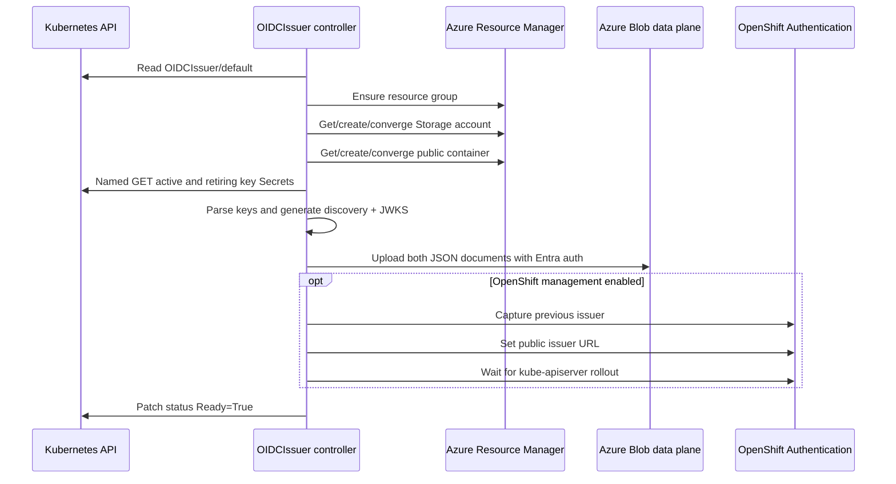

# OIDC publication and issuer handoff

The issuer controller turns a cluster signing-key reference into a stable public OIDC issuer under an Azure Blob container.

## Reconciliation flow



## Storage contract

An operator-created account uses:

- StorageV2;
- Standard LRS;
- Hot access tier;
- HTTPS-only traffic;
- TLS 1.2 minimum;
- public blob access enabled; and
- shared-key access disabled.

The blob container has public blob access so Microsoft Entra ID can fetch the documents. Write access remains authenticated through the operator's Azure identity.

The issuer URL is:

```text
https://<storage-account>.blob.core.windows.net/<container>
```

Discovery advertises `id_token`, public subjects, the supported signing algorithms, and `<issuer>/openid/v1/jwks`.

## Key material

The key loader accepts PKIX public keys and supported private-key PEM encodings, derives public keys, and publishes only public values. Key IDs are URL-safe base64 SHA-256 hashes of PKIX DER public keys.

An active and retiring reference allow overlapping JWKS publication. Duplicate key IDs are emitted once; distinct algorithms are advertised once in discovery.

## OpenShift control loop

When enabled, issuer management is not a one-time patch. The controller watches and periodically converges `Authentication/cluster`. It records the previous value before the first change and waits for relevant ClusterOperators after an update.

This tight control loop explains the handoff order: disable management and wait for the exact generation before manually restoring the setting.

## Deletion guard

Both admission and reconciliation check dependencies. The finalizer is removed only after:

- no `WorkloadIdentity` objects remain;
- newly minted service-account tokens no longer report this issuer;
- the token issuer can be verified; and
- OpenShift no longer points at this issuer.

These checks prevent a public key endpoint from disappearing while the cluster still produces tokens that depend on it.
