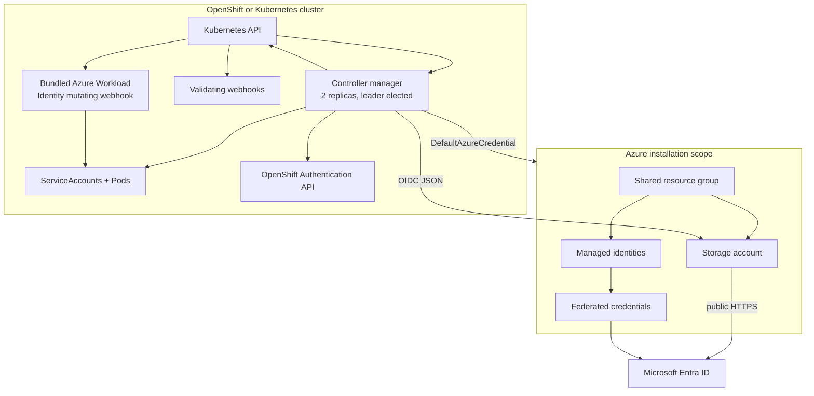

# Architecture overview

The operator is one controller-runtime manager with three reconcilers and three validating webhooks. It coordinates Kubernetes state with Azure Resource Manager, Azure Storage, public OIDC documents, and—in OpenShift—the cluster Authentication API.

## Runtime topology

## Process composition

At startup the manager:

1. configures JSON logging and optional OpenTelemetry;
2. parses and validates the configured Azure scope;
3. validates the mounted retained scope anchor when configured;
4. constructs the Kubernetes REST configuration and controller manager;
5. creates `DefaultAzureCredential`;
6. discovers whether the OpenShift Authentication API exists and configures
   the service-account token issuer guard;
7. registers controllers and validating webhooks; and
8. starts secured metrics, health, and webhook servers under leader election.

Azure Resource Manager, managed identity, and Storage clients are constructed
lazily during reconciliation. Invalid tracing configuration degrades only
tracing. Invalid Azure scope or scope-anchor mismatch terminates startup before
the Kubernetes manager or Azure credential is created.

## Controller boundaries

| Controller | Primary resource | Secondary inputs | External writes |
| --- | --- | --- | --- |
| OIDC issuer | `OIDCIssuer` | signing-key Secrets, `WorkloadIdentity` list, OpenShift Authentication and ClusterOperators | resource group creation, Storage account/container convergence, blob uploads, optional issuer setting |
| Workload identity | `WorkloadIdentity` | `OIDCIssuer`, ServiceAccount, recovery status | managed identity and credential convergence, ServiceAccount create/patch/delete |
| Recovery | `WorkloadIdentityRecovery` | target `WorkloadIdentity`, `OIDCIssuer`, ServiceAccount | recovery fencing, credential ensure, ServiceAccount transfer, managed identity ownership commit |

## Watches and periodic reconciliation

The controllers combine event watches with periodic revalidation:

- `WorkloadIdentity` watches its ServiceAccount and the singleton issuer.
- Recovery watches target workload identities and serializes recovery reconciliation with one worker.
- OIDC issuer watches OpenShift Authentication where available.
- Signing-key Secret data is intentionally not watched; the periodic issuer refresh reads exact named Secrets.
- Azure state has no Kubernetes watch, so periodic refresh repairs supported drift.

The default issuer and workload identity base intervals are five minutes. Workload identities receive stable jitter up to 10% to avoid synchronized Azure traffic.

## Availability

The production chart profile runs two manager replicas with leader election and two mutating-webhook replicas. PodDisruptionBudgets keep one replica of each workload available. Soft topology spread prefers different zones and nodes without making small clusters unschedulable.

Only the elected manager performs active reconciliation. All validating webhook replicas can serve admission.
