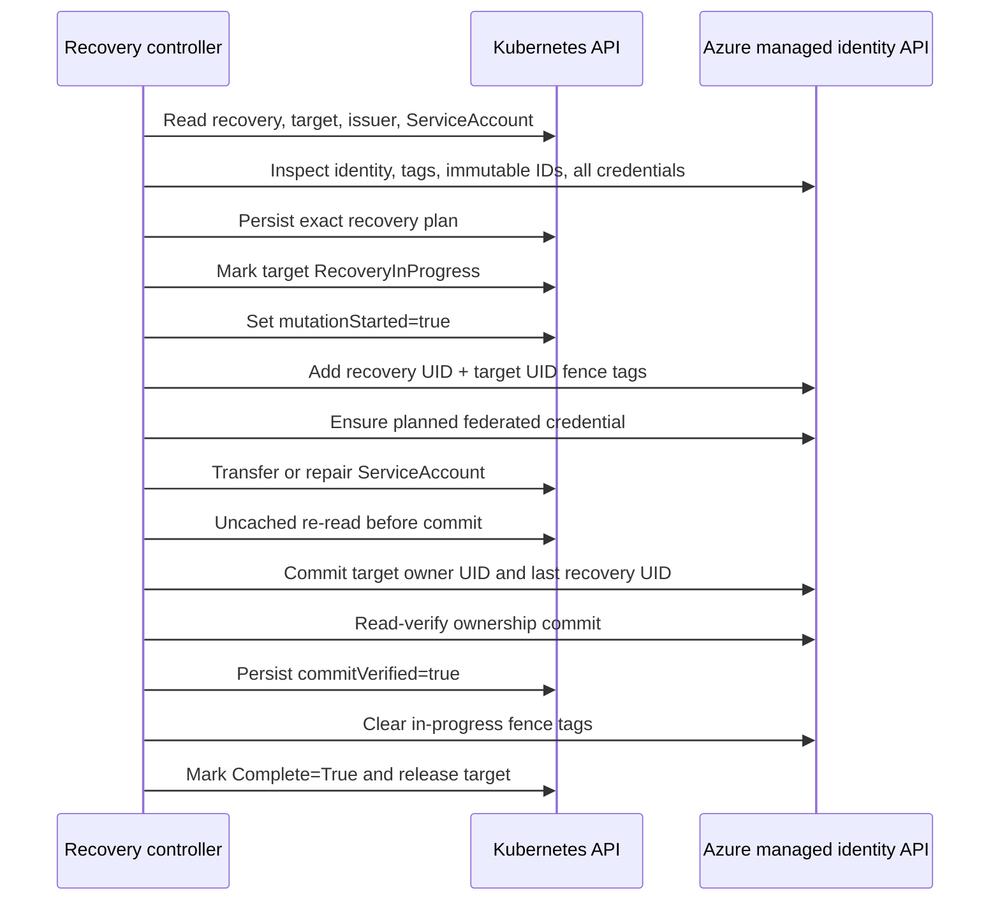

# Recovery protocol

Recovery is a small distributed transaction across Kubernetes and Azure APIs that do not share a transaction manager. The protocol uses a persisted plan, Azure fencing tags, Kubernetes status checkpoints, and read verification to make retries safe.

## Goals

- Transfer only an operator-created retained identity with the exact expected logical key and previous UID.
- Never infer a new owner from a matching Azure name alone.
- Make every retry use the same verified identity and trust tuple.
- Prevent normal reconciliation from writing while recovery owns the identity.
- Finish forward after external mutation begins.

## Protocol

## Preflight is non-mutating

The controller records the managed identity resource ID, client ID, principal ID, tenant ID, issuer, subject, and audiences. It also enumerates all credentials because recovery cannot safely reason from the named credential alone when another conflicting trust exists.

Permanent request errors before mutation become `Failed`. Correctable environmental problems become `Blocked` and retry.

## Fencing

During recovery, Azure carries both a recovery-object UID and target `WorkloadIdentity` UID. Normal workload reconciliation recognizes the pair and reports `RecoveryInProgress` without Azure mutation.

Incomplete or mismatched fence tags are treated as an ownership conflict, not guessed at.

## Commit checkpoint

The Azure ownership change is read-verified before Kubernetes records `commitVerified`. Fencing tags remain after the ownership UID changes, so a crash in that window still keeps normal reconciliation out.

After the checkpoint is durable, finalization clears the in-progress fence. A last-recovery UID remains as audit evidence.

## Deletion semantics

Before mutation, deletion can cancel safely. After mutation, the finalizer converts deletion into “finish, then delete.” This prevents an operator from abandoning a partially transferred identity by deleting its control object.

The user-facing procedure is in [Recover a retained workload identity](../guides/recovery.md).
