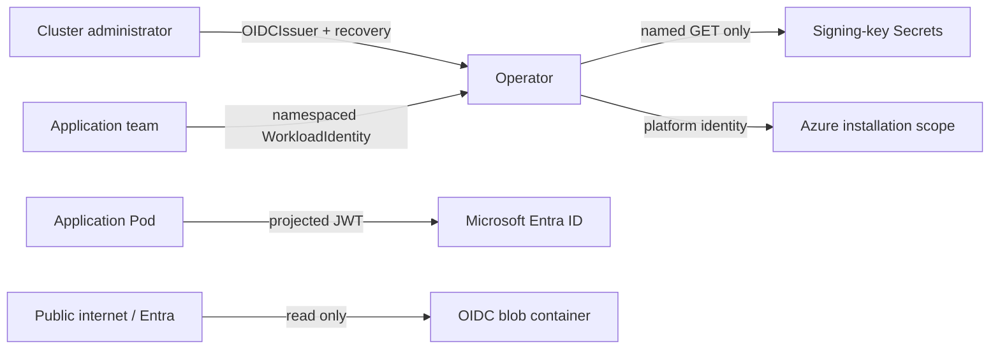

# Security model

The operator is a cluster-trusted controller with Azure infrastructure permissions. Its security model relies on explicit administrative boundaries, ownership evidence, narrow Secret reads, fail-closed admission, and an exclusive-writer operating model in Azure.

## Trust boundaries

## Privileged API surfaces

### `OIDCIssuer`

An issuer administrator can direct the manager to read any named Secret in any namespace. Grant create or update access only to cluster administrators.

### `WorkloadIdentityRecovery`

Recovery can transfer an Azure identity from an earlier Kubernetes object UID. Its cluster scope and separate RBAC roles prevent ordinary namespaced identity editors from gaining this power implicitly.

### `WorkloadIdentity`

Namespaced writers can request identities and ServiceAccount relationships within their namespace, subject to global uniqueness checks for resolved Azure identity names.

## Secret handling

- The operator bootstrap Secret is external to Helm and never rendered by the chart.
- Signing-key access permits `get` only; no list or watch is granted.
- OIDC documents contain public keys only.
- Logs and custom spans do not record tokens, client secrets, authorization headers, request bodies, federated subjects, or audiences.
- OTLP headers should come from a Secret reference.

## Admission

All three custom resources have validating webhooks with `failurePolicy: Fail`. Validation enforces singleton naming, immutable identity fields, signing-key reference separation, global identity and ServiceAccount uniqueness, exact recovery evidence, and recovery spec immutability.

Both webhooks use one shared provider selection: cert-manager, self-managed
certificates delivered through Secrets, or the explicitly selected OpenShift
service CA operator.
Only that provider owns the serving Secrets and CA injection paths. The
bundled webhook cannot read Secrets or update its admission registration; the
kubelet mounts its selected Secret and the chosen controller or Helm-rendered
CA bundle maintains API-server trust.

## Public OIDC surface

The container intentionally serves discovery and JWKS blobs publicly over HTTPS. It does not contain private keys or credentials. Storage account shared-key access is disabled, minimum TLS is 1.2, and write access uses Entra authentication.

## External-writer risk

Azure managed identity APIs lack create-only and ETag preconditions for the operations used here. Another Azure writer can race between the controller's verified read and later write. The supported operating model therefore requires the operator to be the only writer for its deterministic identities and federated credentials.

Use Azure RBAC and policy to enforce that boundary. Resource names and tags are safety evidence, not a substitute for access control.

## Availability and denial of service

Fail-closed admission means certificate or webhook unavailability can block custom-resource changes and selected Pod creation. The production profile uses two replicas, disruption budgets, soft topology spread, and no service-mesh dependency to reduce that risk.

Telemetry export is explicitly fail-open relative to operator function: queues are bounded, spans can drop, and invalid configuration disables tracing without stopping the manager.

## Destructive-operation controls

- External cleanup defaults to retain.
- Finalizers require ownership re-verification.
- Issuer deletion is blocked while dependencies or token issuance remain.
- Recovery becomes forward-only after mutation.
- CRDs and the startup anchor are retained by Helm.

Administrators must still protect direct finalizer removal, CRD deletion, Azure tag editing, and startup-anchor deletion through RBAC and change control.
