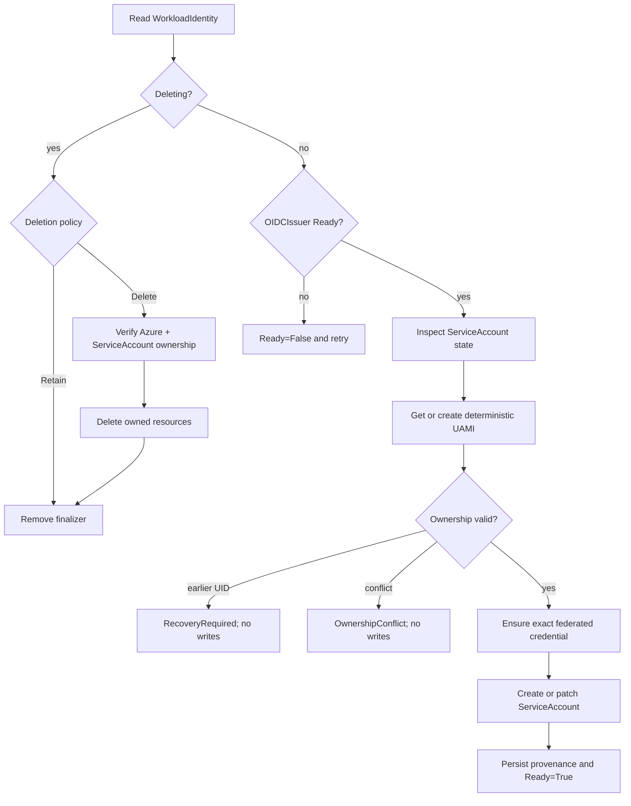

# Workload identity reconciliation

The workload identity controller treats the Azure identity, federated credential, and ServiceAccount as one logical relationship while preserving separate ownership evidence for each system.

## Reconciliation sequence



## Deterministic names and keys

The managed identity name is exactly `spec.azure.userAssignedIdentityName`; the namespace is not prepended. Admission rejects case-insensitive collisions across all workload identities.

The ownership logical key is lowercase hexadecimal SHA-256 of `<namespace>/<WorkloadIdentity name>`. It is independent of object UID, allowing the controller to recognize a recreated logical object without authorizing it automatically.

## Trust tuple

The federated credential is exact:

```text
issuer   = OIDCIssuer.status.issuerURL
subject  = system:serviceaccount:<namespace>:<serviceaccount>
audience = api://AzureADTokenExchange
```

If a credential exists with a different tuple, the controller reports a conflict before overwriting it unless the surrounding managed identity has already passed complete ownership verification and the mismatch is authorized drift for that same resource.

## Azure concurrency limitation

Azure's managed identity and federated credential APIs do not provide the resource ETag preconditions needed for a fully atomic compare-and-swap workflow. The supported model therefore excludes other writers from creating or changing the operator's deterministic identities.

The controller validates ownership on its initial identity read before credential mutation. External writers operating concurrently would violate this boundary even if their intended values look compatible.

## ServiceAccount provenance

The controller persists how the relationship began:

- `Created`: ServiceAccount was absent and created by the operator.
- `Adopted`: ServiceAccount already existed and passed adoption checks.

The persisted status is the normal source of truth; labels provide visible evidence and a guarded crash-recovery fallback if creation succeeded before status was written.

This logical provenance survives deletion and recreation of the ServiceAccount. It controls whether `deletionPolicy: Delete` may remove it later.
