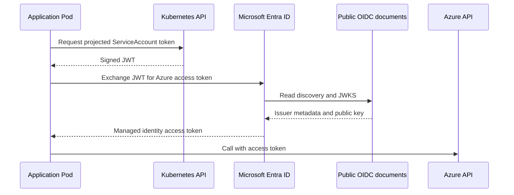

# Authentication paths

There are two separate authentication relationships. Confusing them is a common source of over-permissioned deployments.

## The operator authenticates to Azure

The manager uses the Azure SDK `DefaultAzureCredential`. On first installation, the chart can expose a Service Principal through an externally managed Secret. `azure.credentials.secretRef` selects the Secret and the three data keys whose values become:

```text
AZURE_CLIENT_ID
AZURE_TENANT_ID
AZURE_CLIENT_SECRET
```

That identity needs the platform permissions required to reconcile storage, managed identities, and federated credentials. It does not need the application roles later used by workloads.

After the control plane is established, the manager can migrate to an already-existing workload or managed identity:

1. establish the new identity outside the release;
2. grant it the documented operator permissions;
3. for workload identity, annotate the manager ServiceAccount and select the manager Pods for mutation;
4. remove `azure.credentials.secretRef` from the values and upgrade without `--reuse-values`;
5. verify reconciliation; and
6. remove the old Secret.

The chart does not expose an authentication-mode switch. `DefaultAzureCredential` selects the available mechanism.

## Applications authenticate through federation

The application path contains no client secret:

1. The mutating webhook injects a projected ServiceAccount token and Azure environment variables into a selected Pod.
2. The application or Azure SDK reads the token.
3. Microsoft Entra ID verifies its issuer signature against the public JWKS.
4. Entra matches issuer, subject, and audience against the federated identity credential.
5. Entra returns an Azure access token for the managed identity.



Application authorization is assigned to `WorkloadIdentity.status.principalID`. It remains an application or platform policy decision; the operator does not grant workload roles.
