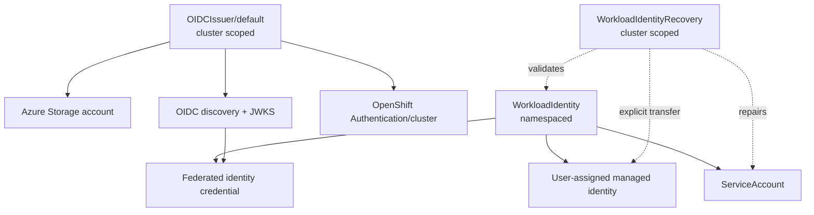

# Resource model

The API separates cluster trust, application identity, and exceptional ownership transfer into three resources with different authorization boundaries.



## `OIDCIssuer`

`OIDCIssuer` is cluster scoped and only the name `default` is supported. It:

- ensures the shared resource group exists;
- creates or converges an Azure StorageV2 account;
- creates a public blob container;
- reads active and optional retiring signing keys from Kubernetes Secrets;
- generates OIDC discovery and JWKS documents;
- uploads those documents with Microsoft Entra ID authentication; and
- optionally sets `Authentication/cluster.spec.serviceAccountIssuer` on OpenShift.

There is one issuer because all `WorkloadIdentity` resources consume the same cluster token issuer.

## `WorkloadIdentity`

`WorkloadIdentity` is namespaced. Its namespace participates in the Kubernetes subject, while the Azure identity name is configured explicitly:

- Azure identity: `<spec.azure.userAssignedIdentityName>`
- Token subject: `system:serviceaccount:<namespace>:<spec.serviceAccount.name>`
- Azure audience: `api://AzureADTokenExchange`

The resource reconciles a logical ServiceAccount relationship. It records whether the ServiceAccount was initially `Created` or `Adopted`; that provenance remains stable if the ServiceAccount is later deleted and recreated under the same namespace and name.

## `WorkloadIdentityRecovery`

`WorkloadIdentityRecovery` is cluster scoped because it can transfer ownership of an Azure identity between two Kubernetes object instances. It references:

- the namespace, name, and UID of the current `WorkloadIdentity`; and
- the previous UID recorded on the retained managed identity.

This API is intentionally separate from ordinary namespaced identity management. A user who can create `WorkloadIdentity` resources does not automatically receive recovery power.

## Azure installation scope

Every resource uses one operator startup scope:

```text
Azure subscription
└── shared resource group
    ├── OIDC Storage account
    │   └── public blob container
    └── user-assigned managed identities
        └── federated identity credentials
```

The resource group can pre-exist or be created by the operator. It is shared infrastructure and is never deleted by the operator.
