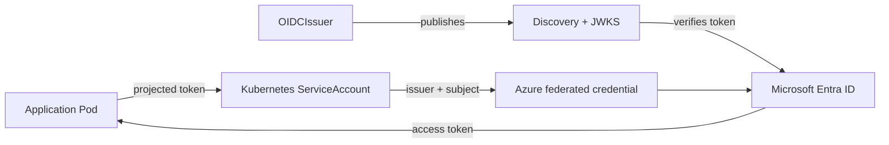

# What the operator does

The Azure Workload Identity Operator creates and maintains the trust path that lets a Kubernetes Pod authenticate to Azure without carrying a client secret.

It joins four pieces of state:

1. a Kubernetes service-account token issuer;
2. public OpenID Connect (OIDC) discovery and JSON Web Key Set (JWKS) documents;
3. an Azure user-assigned managed identity and federated identity credential; and
4. a Kubernetes ServiceAccount annotated for the Azure Workload Identity mutating webhook.

## Why use an operator

Azure workload identity spans Kubernetes and Azure. A manually assembled integration can drift on either side: the ServiceAccount can be recreated, a federated credential can change, signing keys can rotate, or an Azure resource can outlive the Kubernetes object that once owned it.

The operator continuously reconciles those boundaries. It also records ownership evidence before it changes or deletes external resources.

## The three custom resources

| Resource | Scope | Responsibility |
| --- | --- | --- |
| `OIDCIssuer` | Cluster | Publishes discovery and JWKS documents and can hand the issuer URL to OpenShift. Exactly one supported instance exists, named `default`. |
| `WorkloadIdentity` | Namespace | Reconciles one managed identity, one federated credential, and one logical ServiceAccount relationship. |
| `WorkloadIdentityRecovery` | Cluster | Explicitly transfers a retained operator-created managed identity to a recreated `WorkloadIdentity`. |

Read [Resource model](../concepts/resource-model.md) for the detailed relationships.

## Support boundary

The project is OpenShift-first. OpenShift 4.22.8 is the required production acceptance target. Chart lifecycle and admission are also tested on Kind, but the complete issuer and Azure token-exchange path is not yet covered end to end on vanilla Kubernetes. Other distributions are therefore compatibility preview.

See [Compatibility and support](../operations/compatibility.md) before choosing a production target.

## Safety properties

- **Retention is the default.** Deleting a custom resource leaves its Azure resources unless `deletionPolicy: Delete` was selected.
- **Azure scope is installation identity.** One installation owns one subscription, resource group, and location; a retained immutable ConfigMap prevents silent scope changes.
- **Managed identities are exclusive.** Normal reconciliation never arbitrarily adopts or transfers an existing managed identity.
- **Recovery is explicit and fenced.** Ownership transfer uses the cluster-scoped recovery API and becomes forward-only after the first external mutation.
- **Issuer removal is guarded.** The `OIDCIssuer` cannot disappear while workload identities still depend on it or the cluster still mints tokens with its issuer URL.

Continue with [Installation](./installation.md), or go directly to the [architecture overview](../architecture/overview.md).
