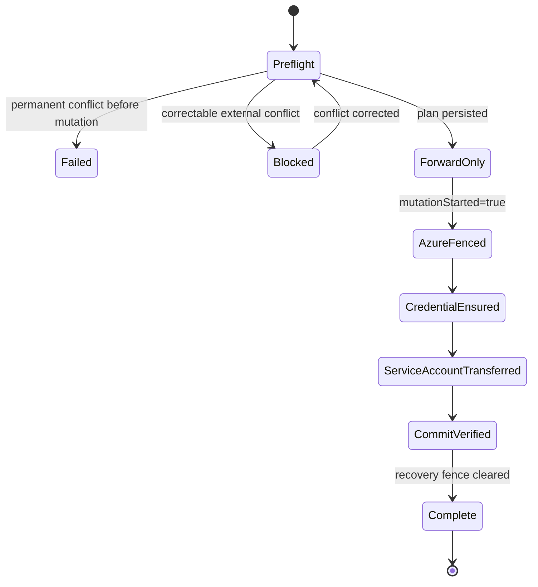

# Recover a retained workload identity

`WorkloadIdentityRecovery` transfers an operator-created retained Azure user-assigned managed identity from an earlier `WorkloadIdentity` instance to the current instance with the same namespace and name.

This is an exceptional cluster-administrator operation. Normal reconciliation never adopts an arbitrary identity or silently changes its owner UID.

## Recognize recovery-required state

A recreated `WorkloadIdentity` finds the same deterministic Azure identity name. If the identity has the correct stable logical key and operator ownership but an earlier Kubernetes UID, the controller makes no Azure or ServiceAccount writes and reports:

```yaml
status:
  recovery:
    previousWorkloadIdentityUid: <previous-uid>
  conditions:
    - type: Ready
      status: "False"
      reason: RecoveryRequired
```

Any other ownership mismatch reports `AzureResourceOwnershipConflict` and is not recoverable through this flow.

## Start recovery

Read the current object rather than using values from Git:

```bash
kubectl get workloadidentity \
  --namespace '<namespace>' \
  '<name>' \
  -o yaml
```

Create a cluster-scoped recovery with the exact namespace, name, current UID, and previous UID:

```yaml
apiVersion: workloadidentity.azure.micosolutions.se/v1alpha1
kind: WorkloadIdentityRecovery
metadata:
  name: recover-reports-api
spec:
  workloadIdentityRef:
    namespace: reports
    name: reports-api
    uid: '<current-workloadidentity-uid>'
  previousWorkloadIdentityUid: '<status.recovery.previousWorkloadIdentityUid>'
```

Admission requires that:

- the referenced current object exists and is not deleting;
- its exact generation reports `Ready=False`, reason `RecoveryRequired`;
- the previous UID matches its status evidence;
- the current and previous UIDs differ; and
- no other visible recovery uses the same previous UID.

The spec is immutable. A controller-side uncached check resolves races between duplicate recovery objects; the oldest eligible recovery wins and later duplicates become terminal `Failed=True` with reason `DuplicateRecovery`.

## Understand the phases



Before mutation, the controller:

- verifies the exact managed identity resource ID;
- verifies operator ownership, logical key, and previous UID;
- records immutable client, principal, and tenant IDs;
- enumerates the full federated credential set and rejects conflicting credentials;
- verifies the target `OIDCIssuer` is Ready; and
- validates the ServiceAccount can be transferred safely.

It persists this exact plan before setting `status.mutationStarted: true`.

After mutation starts, recovery is forward-only. The controller:

1. writes Azure fencing tags;
2. ensures the planned federated credential trust tuple;
3. transfers and repairs the target ServiceAccount when it exists, or records
   its absence for normal reconciliation after recovery;
4. re-reads recovery, target, ServiceAccount, and Azure state before commit;
5. changes the managed identity owner UID and read-verifies it;
6. checkpoints `commitVerified` in Kubernetes; and
7. clears the recovery fencing tags and marks `Complete=True`.

## Monitor recovery

```bash
kubectl get workloadidentityrecovery/recover-reports-api -o yaml
kubectl get workloadidentity/reports-api --namespace reports -o yaml
```

Interpret conditions:

| Condition | Meaning |
| --- | --- |
| `Progressing=True` | The plan or forward recovery is advancing. |
| `Blocked=True` | A correctable external conflict prevents progress; keep the same object and fix the conflict. |
| `Failed=True` | Recovery ended before mutation because the request was invalid or lost a duplicate race. |
| `Complete=True` | Azure ownership commit was verified and the recovery fence was cleared. |

## Handle interruption

Do not delete and recreate a recovery after `mutationStarted=true`. Its finalizer deliberately keeps it present and drives the same recorded plan forward.

Protect the target `WorkloadIdentity` and its namespace from deletion for the
entire recovery. Use narrowly granted RBAC, admission policy, and a paused or
reviewed GitOps prune path appropriate to the cluster.

If the target `WorkloadIdentity` disappears after mutation begins, the
controller reports `Blocked` because it requires the exact UID recorded in the
recovery plan. A normal delete-and-recreate operation cannot restore that UID:
the Kubernetes API server assigns every replacement a new UID. Treat this as
an incident requiring implementation-specific manual escalation or restoration
of the original object identity through a supported control-plane recovery
procedure. Do not point the recovery at a replacement object.

If the target ServiceAccount is absent, recovery can commit without creating
it. After the recovery fence is cleared, normal `WorkloadIdentity`
reconciliation creates the ServiceAccount and applies the managed labels and
annotations. If a ServiceAccount appears during the commit window, recovery
retries and validates or transfers it before proceeding.

If the recovery is blocked by ServiceAccount or Azure drift, correct the reported conflict without replacing the recovery object. The controller retries every 30 seconds and on relevant watch events.

## Delete recovery history

- Before mutation, deleting the recovery cancels it and removes any target in-progress condition.
- After mutation, deletion cannot cancel the operation; the finalizer drives recovery to completion first.
- After completion, the object remains as audit history until explicitly deleted.

Bind `workloadidentityrecovery-editor-role` or `workloadidentityrecovery-admin-role` only to cluster administrators authorized to perform ownership transfer.
